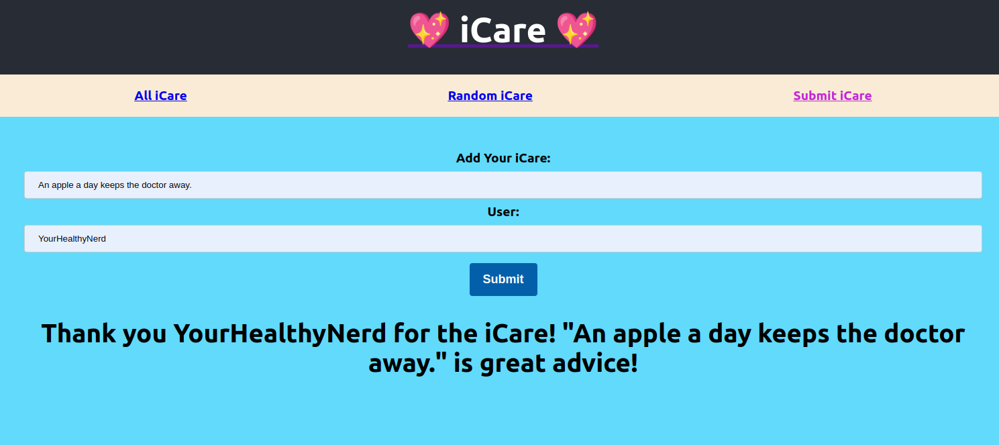
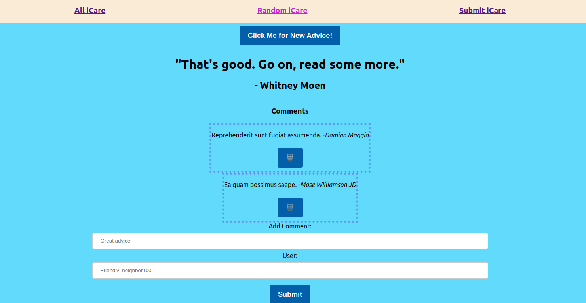

# iCare

iCare is a fun website where you may share knowledge you've learned from experience, interesting facts, or anything else you enjoy! It is OK as long as it is polite.

# Navigation Bar
Users may see the site's pages in the navigation bar at the top of the page. They may choose how they want their own advise to be attributed by posting it themselves, browsing all previously uploaded pieces of advice, or having the website show a piece of advice at random.

# iCare Post
The website will thank the user by name and let them know that their iCare is highly insightful when they submit a piece of advice.

# Browse all iCare
Users can see all advice posted in the "All iCare" page. They can even see their own iCare if they posted one.

# iCare + its Comments
Under the 'Random iCare', a user can generate a random iCare together with its comments if any. The iCares are generated randomly by the program and the user may delete any comment they seem unfit for the website. So no haters allowed!!

# Conclusion
This project was made to practice creating and using a relational database and API using Ruby, Active Record, and Sinatra to create a fullstack program where the front end was made with using React.

## Checkout the backend here: https://github.com/livya-kendi/Backend-phase3-project.git